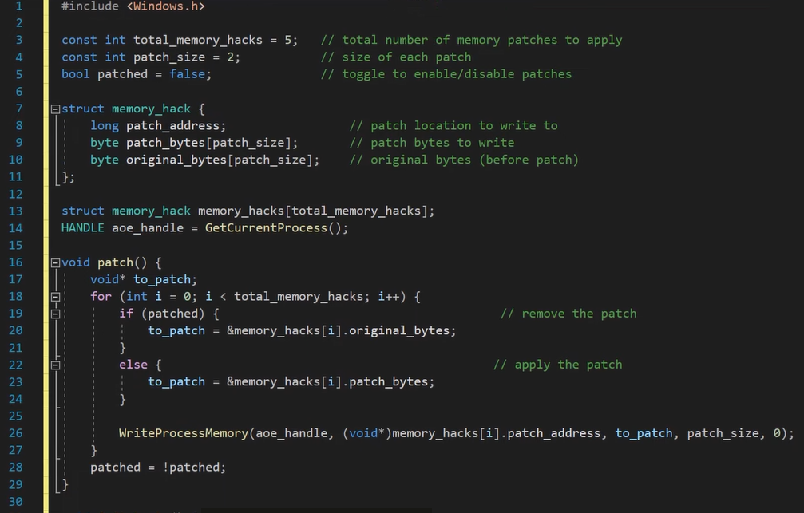
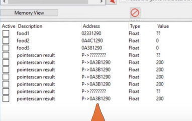
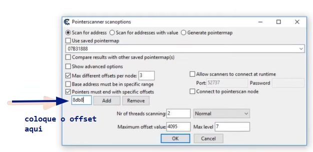
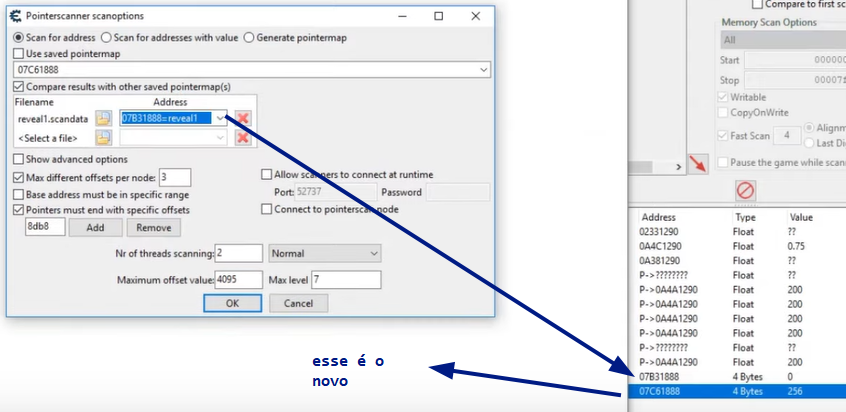

# 247CTF Hacking Playlist

Uma playlist com vídeos de como fazer o hacking dos cheats em um jogo.

### Ferramentas usadas
Binary Ninja  
OllyDBG  
Cheat Engine  
Visual Studio ? (Usaremos VSCode)

### Lista de vídeos
--- 
**[1] Reverse Engineering hidden game cheat codes - 12:05**
Explicando como funciona o hacking, introdução básica.

**[2] Binary patching game cheat codes - 9:29**  
Aqui ele procurou pelo byte que é trocado toda vez que ele acessa o cheat. Achado o endereço que escreve nesse byte, ele achou a função que faz o desenho da tela, e trocou a rotina que pega o valor atual deste byte e forçou ele para sempre ser igual a 1; fazendo o patch no Binary Ninja.  
  
  
**[3] Hacking a game with DLL injection - 10:58**  
Ele começa explicando que binary patching não é bom por que o programa pode ser atualizado, o que mudaria os endereços de memória, ou ainda, não é flexível por que o valor fica constante, mas seria interessante que pudessemos mudá-lo a hora que quiser (como ao pressionar um botão). 
Isso introduz ao assunto de DLL injection.
  
Primeiro, enumeramos todos os processos e verificamos qual tem o mesmo nome do target (linha 10). Achado o processo, pegamos seu pID (que é único).

  
Com o pID, abrimos um HANDLE para o processo (linha 28), alocamos memória para a DLL (linha 29), escrevemos o nome da DLL dentro o processo do jogo (linha 31) e criamos uma RemoteThread para rodar a DLL. Isso é suficiente para executar código dentro do processo através de um programa externo.
Vamos fazer o Attach da DLL no processo do jogo. Isso requer uma função DLLMain, que será chamada assim que a DLL for injetada e a thread começar a rodar.

  
Vamos criar a DLL aqui. Ela verifica se o usuário pressionou uma tecla, mostrando uma MessageBox. Isso é tudo!  
**OBS:** Compile no GCC usando -shared para compilar uma DLL!

  
  
Vamos criar o trainer, ele irá fazer o patch em tempo de execução. Para fazer um patch, precisamos armazenar algumas variáveis: o endereço de memória onde queremos aplicar o patch (linha 8), os dados que queremos escrever dentro deste endereço (linha 9), e os dados atuais que estão neste endereço (linha 10).  
Iniciamos os dados dos endereços que encontramos, e os bytes que queremos gravar - os hacks em si (linhas 32-36). Nessas linhas, temos o endereço, 2 valores representando os bytes do patch/originais (para poder fazer o patch ser desligável), e um objeto para guardar o valor original. Depois, para cada endereço de patch, lemos a memória para pegar os valores originais dos bytes e guardá-los na estrutura afim de podermos restaurar depois (linhas 38-40). Agora vamos para a função de patch. Ela enumera cada um dos patches (linha 18) e verifica o que estamos tentando fazer: se o patch já tiver sido feito (linha 19), coloca em uma variável os bytes originais para desfazer o patch (linha 20). Senão, coloca na variável os bytes que habilitam o cheat (linha 23). Por fim, escreve naquele endereço de memória o valor da variável (linha 26), e liga/desliga a flag que indica se fez o patch ou não (linha 28).

**[4] Memory Scanning & Resource Hacking with Cheat Engine - 12:51**  
O vídeo começa usando o Cheat Engine para procurar o endereço que guarda valor de um recurso do jogo usando o método de procurar o valor inicial, gastar um pouco, e procurar o novo valor. Após achar esse endereço, mudá-lo mudará no jogo também. Porém este endereço não existe caso você reinicie o jogo. Isto porque é uma memória de local dinâmico. Todo valor deve estar em um endereço, e todo endereço mesmo os dinâmicos devem ter um ponteiro que indica onde eles estão: um endereço de memória que não muda + um offset. 
  
Se pudermos achar o endereço base de um player, podemos ir seguindo os endereços subsequentes para encontrar os valores relacionados àquele player!  
Ele continua indo pro Cheat Engine, procurando pelo valor de um recurso novamente como na primeira vez, mas desta vez ele usa uma função chamada "Generate pointermap".

  
Após salvar o arquivo, ele clica sobre o endereço novamente e usa a função "Pointer scan for this address".

  
Aqui, ele clica na caixa "Use saved pointermap", e seleciona o arquivo que foi salvo. Depois do scan, o CE identifica alguns endereços que podem ser o endereço base que estamos procurando. 

  
Perceba como os endereços apontam para o endereço dinâmico! Mas pode ser que estes pointers também sejam dinâmicos. Por isso, ele reinicia o jogo, e refaz mais uma vez todo o processo: procura pelo valor do recurso, gasta um pouco ele, procura novamente, acha o endereço dinâmico. Quando clicado em "Pointer scan for this address", ele faz:

  
Isso requer um novo savefile, após salvar o CE faz a comparação entre todos os ponteiros dinâmicos dos dois resultados que são candidatos a serem o ponteiro base do valor que queremos. Ele explica que precisamos dos pointeiros que estão no processo do jogo, por isso tem que ficar atento aos nomes na coluna "Base Address". Além disso, é bom olhar para os ponteiros que tenham menos Offsets, por isso ele ordena os ponteiros clicando na coluna "Offset 4" para que os que não tiverem nada nessa coluna fiquem em cima. Após isso, ele seleciona alguns desses ponteiros clicando 2x em cima, e muda os valores deles para float (na janela de endereços principal). Agora ele reinicia o jogo mais uma vez, e tenta usar esse endereço para mudar os valores que tanto procuramos.

  
Perceba como aquele ponteiro não mudou seu valor após reiniciar (apesar de um ter mudado e ficado ?????). Pronto, achamos o endereço base do recurso do jogo!  
Agora é só procurar por esse endereço em um debugger e editar pra ver se funciona.
Ele continua pegando o endereço de memória que revela o mapa do video anterior, e tenta fazer o mesmo processo no CE. 

  
  
Primeiro, ele recalcula o endereço dinâmico que está na função de desenho do jogo (achado anteriormente no outro video), adiciona o endereço na lista do CE manualmente, e faz um "Generate pointermap", salvando o arquivo. Porém o resultado não retornará nenhum candidato ao tentar ver com a opção "Pointer scan for this address". Precisamos colocar o offset do ponteiro:

  
O offset do ponteiro que estava em edx precisa ser passado alí. Após isto, reiniciou o jogo, foi no debugger, pegou o novo endereço dinâmico da mesma forma que antes, e no CE adicionou manualmente e usou a função "Generate pointermap". Agora, na hora de comparar, ele usou o endereço achado anteriormente:

  
Assim, após selecionar alguns candidatos na tela de ponteiros, no campo de endereços do CE teremos o endereço base. Ufa!
Resumindo, precisamos:
* Encontrar o endereço dinâmico do valor que queremos fazer patch;
* Gerar um pointermap desse endereço;
* Indo na função "Pointer scan for this address", usar o pointermap salvo;
* Se estiver vazio os candidatos, usar o endereço de offset achado em um debugger;
* Gerar o valor novamente, criando um novo endereço (provávelmente diferente);
* Gerar um novo pointermap ? (acho que não precisa)
* Usar a função "Pointer scan..." nesse novo endereço, e comparar com o valor antigo.
* Na lista de candidatos, pegar alguns ponteiros e adicioná-los à lista de endereços (os que forem do processo, e que tiverem menos offsets).

**[5] From Cheat Engine to a DLL - how to make a working game trainer in C - 10:45**  
O video começa explicando que ele mudará as funções de leitura e escrita de memória que são da API do Windows para uma outra abordagem.

  
O código agora terá o uso da função VirtualProtect (linha 6) para modificar a proteção de memória naquela área que queremos gravar dados. A leitura/escrita dos dados se dará através de uma "troca" de valores entre duas variáveis, usando a função memcpy (linha 7). Quando queremos ler, o destino será uma variável buffer, e a origem o endereço da memória que contém o dado. Quando queremos gravar será o contrário: o destino é o endereço de memória, e a origem é a variável buffer. Engenhoso! Após a leitura/gravação, restauramos a proteção da área da memória (linha 8).

**[6] Function hooking, detours, inline asm & code caves - 15:29**   

**[7] Reverse engineering player structures in a game - 12:42**   

**[8] Hooking, hijacking & spying on player resource data structures - 10:28**  